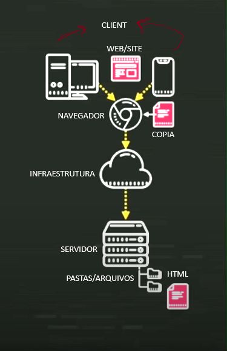

# 📒 Anotações - Curso de JavaScript

Bem-vindo(a) às anotações do módulo A de JavaScript do **Curso em Vídeo**!  
Aqui você encontrará resumos, exemplos e explicações das principais aulas.

## 📚 Conteúdo das Aulas

### Módulo A
- [Aula 01 - O que faz o JavaScript?](#aula-01-o-que-faz-o-javascript)
- [Aula 02 - Evolução do JavaScript](#aula-02-evolução-do-javascript)
- [Aula 03 - Primeiros Passos JavaScript](#aula-03-primeiros-passos-javascript)
- Aula 04

---

## [Aula 01: O que faz o JavaScript?](https://youtu.be/Ptbk2af68e8?si=4HmA_1PSD4C_ZxyH)

### Client x Servidor

- ``Client:`` Qualquer dispositivo (computador, celular, tablet) que consome serviços de um servidor.  
  **Exemplo:** Ao assistir um vídeo no YouTube, você está acessando informações dos servidores do YouTube.
- ``Servidor:`` É como um computador dedicado, com sistema operacional, pastas, arquivos e diretórios, responsável por fornecer serviços e responder às solicitações dos clientes.

> Qualquer dispositivo conectado à internet pode ser um client.

### Comunicação Client x Servidor

- A comunicação acontece via navegador (ex: Chrome).
- O navegador envia uma solicitação ao servidor, que responde com o caminho ou recurso solicitado.
- Normalmente, o servidor envia uma cópia de um arquivo HTML como resposta.

### Visualização do Site

- O navegador recebe o HTML e é responsável por renderizar e estilizar a página para o usuário.

### JavaScript: Origem e Função

- O JavaScript surgiu para atuar no lado do client, mas hoje também pode ser usado no servidor.
- **Importante:** JavaScript ainda é mais utilizado e eficiente no lado do client.

### As 3 Tecnologias do Front-End

- ``HTML5:`` Estrutura e conteúdo (texto, imagens, mídias) — como um jornalista.
- ``CSS3:`` Estilo e aparência — como um designer.
- ``JavaScript:`` Interatividade e lógica — como um programador.
---
## [Aula 02: Evolução do JavaScript](https://youtu.be/rUTKomc2gG8?si=fSit4-B741vkNm3c)

### História da Linguagem

- ``1970:`` Durante a Guerra Fria, a busca por inovação tecnológica levou à criação da agência DARPA, responsável por pesquisar tecnologias para segurança de dados em computadores gigantescos. Surgiu então a **ARPANET**, uma rede que permitia a comunicação e transferência de dados entre centros militares e universidades. Com o tempo, a ARPANET evoluiu e passou a se chamar **Internet**.

- ``1993:`` Um inglês criou o que hoje conhecemos como **HTML** e o protocolo **HTTP**, fundando a CERN, também conhecida como **WWW** (World Wide Web). Para acessar essas novas tecnologias, foi criado o navegador **Mosaic**, que impulsionou o avanço da web.

- ``1994:`` Surge a empresa **Netscape**, que, baseada no Mosaic, desenvolveu o navegador **Netscape Navigator**, muito popular na época.

- ``1995:`` O HTML era limitado, então foi criada uma linguagem chamada **Mocha**, que depois virou **LiveScript** e, finalmente, **JavaScript**. Paralelamente, surgiu o **Java**, que recebeu grande atenção da mídia. A Microsoft, percebendo o potencial do JavaScript, criou sua própria versão chamada **JScript** e lançou o **Internet Explorer**, baseado no código do Mosaic.

- ``1997:`` Para evitar conflitos entre as versões de JavaScript, a Netscape procurou a organização **ECMA** para padronizar a linguagem, surgindo assim o **ECMAScript** — o padrão que define o JavaScript moderno.

- ``2002:`` A disputa entre Netscape e Microsoft terminou. A Netscape perdeu espaço devido ao Internet Explorer vir instalado no Windows e acabou falindo. Ex-funcionários da Netscape fundaram a **Mozilla**, que mais tarde lançou o navegador **Firefox**.

- ``2008:`` O **Google** entra no mercado de navegadores com o lançamento do **Chrome**.

- ``2009:`` O Chrome trouxe o motor **V8**, que tornou o JavaScript muito mais rápido.

- ``2010:`` Aproveitando o motor V8, foi criado o **Node.js**, permitindo que o JavaScript rodasse fora do navegador, inclusive no lado do servidor.

### ECMAScript e Suas Versões

- **Versão 1.0:** 1997
- **Versão 2.0:** 1998
- **Versão 3.0:** 1999
- **Versão 4.0:** Nunca lançada oficialmente devido à complexidade e promessas não cumpridas
- **ES5:** 2009
- **ES6 (ES2015):** 2015 — trouxe grandes novidades para a linguagem
- **ES2016:** 2016
- **ES2017:** 2017
- **ES2018:** 2018
- E assim por diante, com novas versões lançadas anualmente.

### Evolução e Impacto

- O JavaScript evoluiu muito e hoje é base para diversas tecnologias e frameworks, como: **jQuery, Angular, React, Vue.js, Electron.js, Ionic, Cordova**, entre outros.
- Além do desenvolvimento web, o JavaScript também é utilizado em **aplicações desktop, mobile** e até mesmo em **jogos**.

> **Curiosidade:** O JavaScript é uma das linguagens mais populares do mundo, presente em praticamente todos os navegadores e plataformas modernas.

---
## [Aula 03: Primeiros Passos JavaScript](https://youtu.be/FdePtO5JSd0?si=iLHr5d9jnekpHan3)

Nessa aula, não houve anotações, pois a aula foi mais uma conversa, orientações, duvidas, recomendações e exemplos, conversa sobre crenças militantes e instalações dos softwares para dar inicia a aula 4.

Software usado durante as aulas: 

- VS Code: Editor de codigo
- Chrome: Navegador
- Node.js: Rodar fora do navegador
- Hyper: Terminal

> _Última atualização: 26/05/25 por Ivan Rocha_