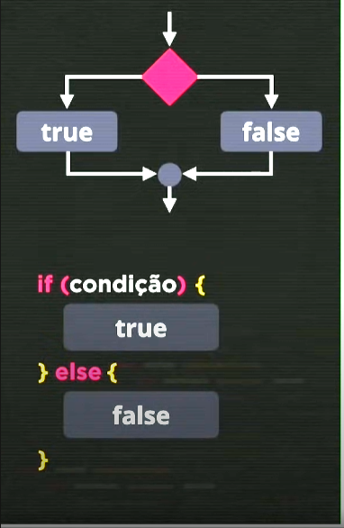
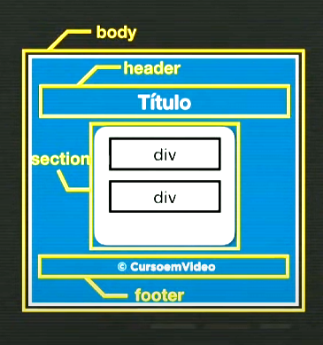

# 📒 Anotações - Curso de JavaScript

Bem-vindo(a) às anotações do módulo D de JavaScript do **Curso em Vídeo**!  
Aqui você encontrará resumos, exemplos e explicações das principais aulas.

### Resumo Geral

Este README reúne minhas anotações pessoais do Módulo D do curso de JavaScript do ``Curso em Vídeo``.  
Organizei o conteúdo por aulas, trazendo resumos dos principais conceitos, exemplos práticos, dicas e observações que considero úteis para revisão e fixação.

- ``Aula 11:`` - Condições I
- ``Aula 12:`` - Condições II
- ``Aula 13:`` - Exercicio 01
- ``Aula 14:`` - Exercicio 02
- ``Aula 15:`` - Exercicio 03

> Lembrete: O título de cada aula contém um link direto para o respectivo vídeo no YouTube do Curso em Vídeo.

## 📚 Conteúdo das Aulas

### Módulo D

- [Aula 11 - Condições I](#aula-11---condições-i)
- [Aula 12 - Condições II](#aula-12---condições-ii)
- [Aula 13 - Exercicio 01](#aula-13---exercício-01)
- [Aula 14 - Exercicio 02](#aula-14---exercicio-02)
- [Aula 15 - Exercicio 03 - Em breve](#aula-15---exercicio-03)

---

## [Aula 11 - Condições I](https://youtu.be/cOdG4eACN2A?si=strWAryZ8l1iAD75)

Nesta aula, começamos a trabalhar com **condições** em JavaScript. Até aqui, nosso código era sempre sequencial: uma linha após a outra, sem desvios. Com as condições, podemos criar bifurcações, ou seja, executar diferentes blocos de código dependendo de uma situação.

---

### O que são condições?

Condições funcionam como um cruzamento: se algo for verdadeiro, seguimos por um caminho; se for falso, seguimos por outro.

**Exemplo sequencial:**
```js
var n = 2
n += 2 // igual a 4
alert(n)
```
Aqui, tudo acontece em sequência.

**Com condição:**
```js
if (idade > 18) {
  alert("Maior de idade")
} else {
  alert("Menor de idade")
}
```
Agora, o fluxo pode mudar dependendo do valor de `idade`.

---

### Estrutura do if/else

- `if (condição) { ... }` — executa o bloco se a condição for verdadeira.
- `else { ... }` — executa o bloco se a condição for falsa.

**Resumo:**
```js
if (condição) {
  // bloco TRUE
} else {
  // bloco FALSE
}
```

Podemos ter apenas o `if` (condição simples) ou `if` + `else` (condição composta).

---

### Tipos de condição

- **Simples:** só executa algo se a condição for verdadeira.
  ```js
  if (condição) {
    // bloco TRUE
  }
  ```
- **Composta:** executa um bloco se for verdadeiro, outro se for falso.
  ```js
  if (condição) {
    // bloco TRUE
  } else {
    // bloco FALSE
  }
  ```

> Se a condição simples for falsa, o código apenas segue normalmente.

---

### Visualizando o fluxo

Veja a imagem:  


---

### Dica: Executando JS no VS Code

> Para testar JS rapidamente no terminal do VS Code, use a extensão [Node.js Exec](https://marketplace.visualstudio.com/items?itemName=miramac.vscode-exec-node) (atalho F8).

---

### Exemplo prático: Sistema de multas

```js
function verificar() {
  let velo = document.querySelector('input#vel')
  let veloci = Number(velo.value)
  let res = document.querySelector('div#res')

  res.innerHTML = `<br>A velocidade do seu carro é de ${veloci}Km/h <br>`

  if (veloci > 80) {
    res.innerHTML += `MULTADO! Velocidade permitida é de 80Km/h. Seu carro estava a ${veloci - 80}Km/h acima do limite. <br>`
    res.innerHTML += `Dirija sempre respeitando os limites de velocidade! <br>`
    res.innerHTML += `Use cinto de segurança!`
  } else {
    res.innerHTML += `Você está dentro do limite de velocidade permitido <br>`
    res.innerHTML += `Use sempre o cinto de segurança <br>`
  }
}
```

**HTML:**
```html
<body>
  <h1>Sistema de multas</h1>
  Velocidade do carro: <input type="number" name="vel" id="vel" placeholder="Velocidade do carro">Km/h
  <input type="button" value="verificar" onclick="verificar()">
  <div id="res"></div>
  <script src="./index.js"></script>
</body>
```

---

### Desafio: Nacionalidade

Adapte o exemplo para verificar se a pessoa é brasileira ou estrangeira:

```js
function verificar() {
  let paisOrigem = document.querySelector('input#textbr')
  let res = document.querySelector('div#res')
  let pais = paisOrigem.value

  res.innerHTML = `<br>O país de origem informado foi: ${paisOrigem.value} <br>`
  if (pais == 'Brasil') {
    res.innerHTML += `Você é brasileiro! <br>`
    res.innerHTML += `Seja bem-vindo ao Brasil novamente! <br>`
  } else {
    res.innerHTML += `Você é estrangeiro! <br>`
    res.innerHTML += `Seja bem-vindo ao Brasil! <br> Welcome to Brazil! <br>`
  }
}
```

**HTML:**
```html
<body>
  <h1>Você é Brasileiro?</h1>
  Seu país de origem é: <input type="text" name="textbr" id="textbr" placeholder="Digite seu país de origem">
  <input type="button" value="Verificar" onclick="verificar()">
  <div id="res"></div>
  <script src="./index.js"></script>
</body>
```

---

### Links para Exercícios Aula 11

- [ex001](./Exercicios/ex001)
- [ex002](./Exercicios/ex002)
- [ex003](./Exercicios/ex003)
- [ex004 - Desafio](./Exercicios/ex004)

---

## [Aula 12 - Condições II](https://youtu.be/EEStcIe8rAM?si=hpBCf5V481EgJFRn)

Na aula anterior, vimos as condições simples e compostas, onde o código seguia por um caminho ou outro, dependendo se a condição era verdadeira ou falsa.  
Agora, vamos além: nem sempre existem só duas opções! Nesta aula, aprendemos sobre **condições aninhadas** e **condições múltiplas**.

---

### Condições Aninhadas

Uma condição aninhada é quando colocamos um `if` dentro de outro `else`. Assim, podemos criar vários caminhos possíveis para o fluxo do programa.

**Exemplo:**
```js
if (condição1) {
  // bloco 1
} else {
  if (condição2) {
    // bloco 2
  } else {
    // bloco 3
  }
}
```
Ou, de forma simplificada:
```js
if (condição1) {
  // bloco 1
} else if (condição2) {
  // bloco 2
} else {
  // bloco 3
}
```
> O `else if` é uma forma mais limpa de escrever condições aninhadas.

---

### Exemplo prático: Situação do voto

```js
let idade = 90

if (idade < 16) {
  console.log('Não vota')
} else if (idade < 18 || idade >= 70) {
  console.log('Voto opcional')
} else {
  console.log('Voto obrigatório')
}
```
Neste exemplo, temos três possibilidades de resposta, dependendo da idade.

---

### Exemplo prático: Saudação por horário

```js
let horas = 13

console.log(`Agora são exatamente ${horas} horas`)

if (horas < 6) {
  console.log("Boa madrugada!!")
} else if (horas <= 12) {
  console.log("Bom dia!!")
} else if (horas <= 18) {
  console.log("Boa tarde!!")
} else if (horas <= 24) {
  console.log("Boa noite!!")
} else {
  console.log("Hora inválida!!")
}
```
Você pode obter a hora atual do sistema usando:
```js
let horas = new Date().getHours();
```

---

### Condição Múltipla: `switch`

Quando precisamos testar **valores exatos** (e não intervalos), podemos usar o `switch`.  
O `switch` é útil para situações pontuais, como dias da semana, meses, opções de menu, etc.

**Exemplo:**
```js
let diaSem = new Date().getDay();

switch (diaSem) {
  case 0:
    console.log('Domingo');
    break;
  case 1:
    console.log('Segunda-feira');
    break;
  case 2:
    console.log('Terça-feira');
    break;
  case 3:
    console.log('Quarta-feira');
    break;
  case 4:
    console.log('Quinta-feira');
    break;
  case 5:
    console.log('Sexta-feira');
    break;
  case 6:
    console.log('Sábado');
    break;
  default:
    console.log('Dia inválido');
    break;
}
```
> **Atenção:** Sempre use `break` ao final de cada `case` para evitar que o código continue executando os próximos blocos.

- O método `getDay()` retorna o dia da semana (0 = domingo, 1 = segunda, ..., 6 = sábado).
- O `default` funciona como o `else` do `if`: só executa se nenhum dos casos anteriores for verdadeiro.

---

### Resumo

- Condições aninhadas permitem criar vários caminhos no código.
- O `else if` deixa o código mais limpo do que vários `if` dentro de `else`.
- O `switch` é ideal para testar valores exatos, não intervalos.
- Sempre use `{}` para delimitar blocos de código em condições.

---

### Links para Exercícios Aula 12

- [ex005](./Exercicios/ex005)
- [ex006](./Exercicios/ex006)
- [ex007](./Exercicios/ex007)

---

## [Aula 13 - Exercício 01](https://youtu.be/b2K7eo5Jdj8?si=Vqv-Z5at9csJiWvZ)

Nesta aula/exercício, criamos um **modelo base de site** para agilizar o desenvolvimento dos próximos projetos e exercícios do módulo.

O modelo visual ficou assim:



Esse padrão será utilizado em todos os demais exercícios para manter a organização e facilitar a reutilização do layout.

Utilizamos **HTML5**, **CSS3** e, futuramente, **JavaScript** para complementar as funcionalidades.

O modelo está salvo no exercício [ex008](./Exercicios/ex008/).

> **Dica:** Para inserir o símbolo de copyright (&copy;) no HTML, basta usar `&copy;`.

---

### Código do Modelo

**HTML:**
```html
<!DOCTYPE html>
<html lang="pt-br">
<head>
  <meta charset="UTF-8">
  <meta name="viewport" content="width=device-width, initial-scale=1.0">
  <title>Modelo dos Exercícios</title>
  <link rel="stylesheet" href="./index.css">
</head>
<body>
  <header>
    <h1>Título</h1>
  </header>
  <section>
    <div></div>
    <div></div>
  </section>
  <footer>
    &copy; Ivan Rocha - 2025
  </footer>
  <script src="./index.js"></script>
</body>
</html>
```

**CSS:**
```css
body {
  background: #181622;
  font: normal 15pt arial, sans-serif;
}

header {
  color: #ff35a8;
  text-align: center;
}

section {
  border-radius: 10px;
  padding: 15px;
  width: 700px;
  height: 500px;
  margin: auto;
  box-shadow: 0px 0px 50px 30px #13111B;
  font: normal 12pt arial, sans-serif;
}

footer {
  color: #FFD600;
  text-align: center;
  font-family: Arial, Helvetica, sans-serif;
  padding-top: 25px;
}
```

---

> **Observação:**  
> Não houve JavaScript nesta primeira aula. O foco foi criar o modelo visual para ser reutilizado nos próximos exercícios.

---

### Link para Exercícios 1

- [ex008](./Exercicios/ex008)

---

## [Aula 14 - Exercício 02](https://youtu.be/UXSWgnbSHxs?si=T10KiWN6EexG9AWO)

Nesta aula, demos continuidade ao exercício anterior. Na aula passada, criamos o modelo base do site. Agora, começamos a construir o site de fato, adicionando funcionalidades e conteúdo dinâmico.

Um ponto importante abordado foi sobre ``direitos autorais na web``. Nem tudo que está disponível na internet é gratuito, principalmente imagens e fontes. É fundamental sempre verificar a origem dos recursos utilizados para evitar problemas legais.

Para imagens gratuitas e de boa qualidade, uma ótima opção é o banco [Pexels](https://www.pexels.com/pt-br).

---

### Código JavaScript Final

```javascript
function carregar() {
  let msg = document.querySelector('div#msg');
  let img = document.querySelector('img#imagem');
  let dataAtual = new Date();
  let hora = dataAtual.getHours();

  // Dia da semana
  let msgDia = document.querySelector('#msgDia');
  let dias = ["Domingo", "Segunda-feira", "Terça-feira", "Quarta-feira", "Quinta-feira", "Sexta-feira", "Sábado"];
  let diaSemana = dias[dataAtual.getDay()];
  msgDia.innerHTML = `Hoje é ${diaSemana}`;

  // Data atual
  let dia = dataAtual.getDate().toString().padStart(2, '0');
  let mes = (dataAtual.getMonth() + 1).toString().padStart(2, '0');
  let ano = dataAtual.getFullYear();
  let dataMsg = document.querySelector('#data');
  dataMsg.innerHTML = `Dia ${dia}/${mes}/${ano}`;

  let saudacao = '';
  if (hora >= 0 && hora < 12) {
    msg.style.color = '#E38357';
    saudacao = 'Bom dia!';
    img.src = "https://images.pexels.com/photos/6120456/pexels-photo-6120456.jpeg?auto=compress&cs=tinysrgb&w=1260&h=750&dpr=1";
    img.style.border = '3px solid #E38357';
  } else if (hora >= 12 && hora <= 18) {
    msg.style.color = '#C39161';
    saudacao = 'Boa tarde!';
    img.src = "https://images.pexels.com/photos/13549506/pexels-photo-13549506.jpeg?auto=compress&cs=tinysrgb&w=1260&h=750&dpr=1";
    img.style.border = '3px solid #C39161';
  } else {
    msg.style.color = '#ff35a8';
    saudacao = 'Boa noite!';
    img.src = "https://images.pexels.com/photos/2085998/pexels-photo-2085998.jpeg?auto=compress&cs=tinysrgb&w=1260&h=750&dpr=1";
    img.style.border = '3px solid #ff35a8';
  }

  msg.innerHTML = `${saudacao}`;

  // Iniciar atualização da hora
  atualizarHora();
  setInterval(atualizarHora, 1000);
}

function atualizarHora() {
  let horaMsg = document.querySelector('#hora');
  let agora = new Date();
  let horaFormatada = agora.toLocaleTimeString('pt-BR', { hour: '2-digit', minute: '2-digit'});
  horaMsg.innerHTML = `Agora é ${horaFormatada}`;
}
```

---

> Fui além do exercício proposto no curso, adicionando funcionalidades extras como exibição do dia da semana, data e atualização dinâmica da hora.  
> Pretendo ainda implementar um termômetro ao lado da saudação (Bom dia/tarde/noite).

---

### Link para Exercício 2

- [ex009](./Exercicios/ex009)

---

## [Aula 15 - Exercicio 03]()

---

## Minhas Considerações Finais

Essas anotações são um resumo do que achei mais importante e interessante no Módulo D do curso de JavaScript do Curso em Vídeo.  
Organizei aqui os conceitos, exemplos e dicas que vão me ajudar a revisar e fixar o conteúdo.

Bora continuar estudando e evoluindo! 🚀

> _Última atualização: 11/06/25 por Ivan Rocha_